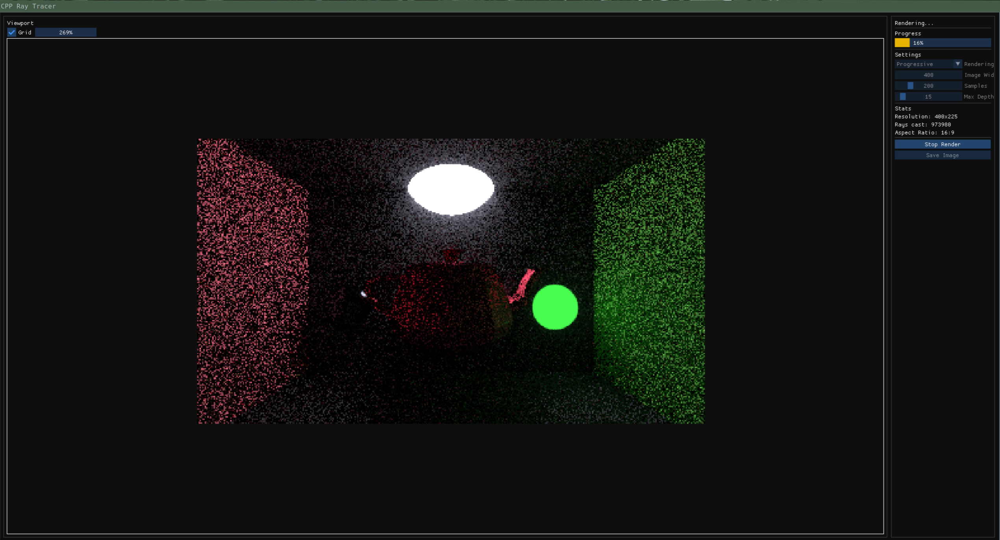

# C++ Ray Tracer

## Screenshots



## Current Features
* Lambertian, Metallic Materials
* Diffuse Lights
* ImGUI Interactive User Interface
* Variable resolution, ray bounce count, samples per pixel
* Intrinsic anti-aliasing 
* Bucketed rendering
* Progressive rendering
* Saving results to png
* Custom OBJ Parser (very basic, still needs work)
* Rendering of primitive shapes like Spheres and Triangles (via Möller–Trumbore intersection algorithm)
* Model Loading

## Todo
* Complete Disney Principled BSDF
* NEE & MIS
* Build a BVH algorithm to accelerate rendering times
* Transmissive materials like glass 

## Build

```bash
make all
```

To build for NVIDIA hardware:
```bash
make BACKEND=nvidia
```

To build for AMD hardware:
```bash
make BACKEND=amd
```

For a release-style build:

```bash
make DEBUG=0 all
```

## Run

```bash
make run
```

The executable is written to `build/raytracer`.